# Getting Started with RV32M1 SDK (RISCV)

## 1 Overview

The RV32M1 Software Development Kit (SDK) provides comprehensive software
support for RV32M1. The RV32M1 SDK includes a
flexible set of peripheral drivers designed to speed up and simplify development
of embedded applications. Along with the peripheral drivers, the RV32M1 SDK
provides an extensive and rich set of example applications covering everything
from basic peripheral use case examples to full demo applications. The
RV32M1 SDK contains FreeRTOS and various other middleware to support
rapid development.

## 2 RV32M1 SDK Board Support Folders

RV32M1 SDK board support provides example applications for RV32M1-VEGA board.
Board support packages are found inside of
the top level boards folder, and each supported board has its own folder
(an RV32M1 SDK package can support multiple boards). Within each
&lt;board\_name&gt; folder, there are various sub-folders to classify the type
of examples they contain. These include (but are not limited to):

- demo\_apps: Full-featured applications intended to highlight key functionality
  and use cases of the target MCU. These applications typically use multiple MCU
  peripherals and may leverage stacks and middleware.
- driver\_examples: Simple applications intended to concisely illustrate how to
  use the RV32M1 SDK's peripheral drivers for a single use case. These
  applications typically only use a single peripheral, but there are cases where
  multiple are used (for example, SPI conversion using DMA).
- rtos\_examples: Basic FreeRTOSTM OS examples showcasing the use of various
  RTOS objects (semaphores, queues, and so on) and interfacing with the
  RV32M1 SDK's RTOS drivers

### 2.1 Example Application Structure

This section describes how the various types of example applications interact
with the other components in the RV32M1 SDK.

Each &lt;board\_name&gt; folder in the boards directory contains a comprehensive
set of examples that are relevant to that specific piece of hardware. We'll
discuss the hello\_world example (part of the demo\_apps folder), but the same
general rules apply to any type of example in the &lt;board\_name&gt; folder.

In the hello\_world application folder you see this:

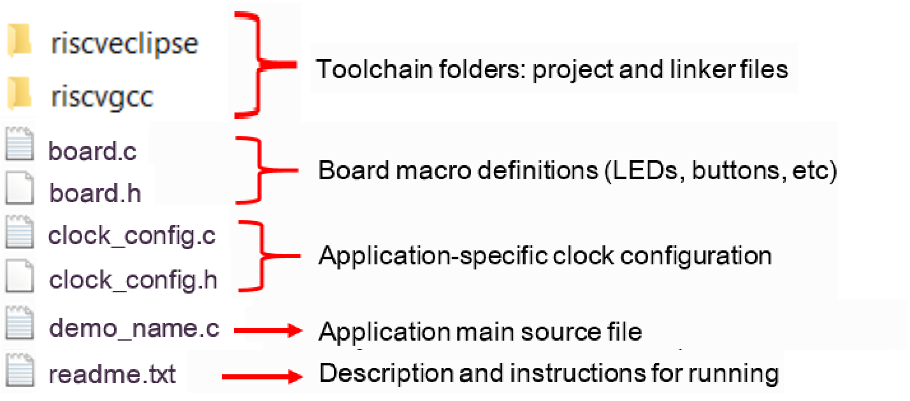

All files in the application folder are specific to that example, so it is easy
to copy and paste an existing example to start developing a custom application
based on a project provided in the RV32M1 SDK.

### 2.2 Locating Example Application Source Files

The RV32M1 SDK devices folder is the central component to all example
applications. It means the examples reference the same source files and, if
one of these files is modified, it could potentially impact the behavior of
other examples.

The main areas of the RV32M1 SDK tree used in all example applications are:
- devices/&lt;device\_name&gt;: The device's CMSIS header file, RV32M1 SDK feature file and a few other things.
- devices/&lt;device\_name&gt;/drivers: All of the peripheral drivers for your specific MCU.
- devices/&lt;device\_name&gt;/&lt;tool\_name&gt;: Toolchain-specific startup code. Vector table definitions are here.
- devices/&lt;device\_name&gt;/utilities: Items such as the debug console that are used by many of the example applications.

For examples containing an RTOS, there are references to the appropriate
source code. RTOSes are in the _rtos_ folder. Again, the core files of each of
these are shared, so modifying them could have potential impacts on other
projects that depend on them.


## 3 Run a demo using GCC

This section describes the steps to configure the command line PULP GCC tools to
build, run, and debug demo applications and necessary driver libraries provided
in the RV32M1 SDK. The hello\_world demo application is used as an example,
though these steps can be applied to any board, demo or example application in
the RV32M1 SDK. If downloading Zero\_riscy core project, let the MCU boot
from the Zero\_riscy core. For detailed steps, see the hello\_world demo readme.txt.

### 3.1 Set up toolchain

This section contains the steps to install the necessary components required to
build and run a RV32M1 SDK demo application with the PULP GCC toolchain,
as supported by the RV32M1 SDK.

#### 3.1.1 Set up on Linux

The steps here are verified on Ubuntu 18.04.

1. Dependency preparation
```bash
sudo apt-get install autoconf automake autotools-dev curl libmpc-dev libmpfr-dev libgmp-dev gawk build-essential bison flex texinfo gperf libtool patchutils bc zlib1g-dev libusb-1.0-0-dev libudev1 libudev-dev g++
```

2. Build the PULP GNU toolchain
To support RV32M1, some patches are applied to the PULP GNU toolchain.
```bash
# clone pulp-riscv-gnu-toolchain
git clone --recursive https://github.com/pulp-platform/pulp-riscv-gnu-toolchain

# clone RV32M1 GNU toolchain patch
git clone https://github.com/open-isa-rv32m1/rv32m1_gnu_toolchain_patch.git

# Copy and apply the patch
cp rv32m1_gnu_toolchain_patch/apply_rv32m1_patches.sh pulp-riscv-gnu-toolchain/
cp -r rv32m1_gnu_toolchain_patch/rv32m1_patches pulp-riscv-gnu-toolchain/
cd pulp-riscv-gnu-toolchain
bash ./apply_rv32m1_patches.sh

# Build the toolchain
./configure --prefix=/opt/pulp --with-arch=rv32imc --with-cmodel=medlow --enable-multilib
sudo make
```
Then the toolchain is installed to `/opt/pulp`. However, you may install to any location.

3. Install CMake
```bash
sudo apt-get install cmake
```

4. Update system variable
```bash
export PATH=$PATH:/opt/pulp/bin
export RISCV32GCC_DIR="/opt/pulp"
```

#### 3.1.2 Set up on Mac OS X

1. Dependency preparation

```bash
brew install gawk gnu-sed gmp mpfr libmpc isl zlib
```

2. Build the PULP GNU toolchain
To support RV32M1, some patches are applied to the PULP GNU toolchain.

```bash
# clone pulp-riscv-gnu-toolchain
git clone --recursive https://github.com/pulp-platform/pulp-riscv-gnu-toolchain

# clone RV32M1 GNU toolchain patch
git clone https://github.com/open-isa-rv32m1/rv32m1_gnu_toolchain_patch.git

# Copy and apply the patch
cp rv32m1_gnu_toolchain_patch/apply_rv32m1_patches.sh pulp-riscv-gnu-toolchain/
cp -r rv32m1_gnu_toolchain_patch/rv32m1_patches pulp-riscv-gnu-toolchain/
cd pulp-riscv-gnu-toolchain
bash ./apply_rv32m1_patches.sh

# Build the toolchain
./configure --prefix=/opt/riscv --with-arch=rv32imc --with-cmodel=medlow --enable-multilib
make
```

Then the toolchain is installed to `/opt/riscv`. However, you may install to any location.

#### 3.1.3 Set up on Windows

The step 2 and step 3 are necessary if you want to build the riscvgcc project in command line.
To use Eclipse, the CMake and MinGW are not required.

1. Download the prebuilt GCC from [here](www.open-isa.org)
  extract the package to some folder, for example
  rv32m1\_gcc. Add a system environment variable `RISCV32GCC_DIR`, set it according to
  your GCC folder, for example: `rv32m1_gcc`. Add `rv32m1_gcc/bin` to system environment
  variable __PATH__.
2. Download CMake from [here](https://cmake.org/download/) and install.
3. Install MinGW. Download the installer from [here](https://sourceforge.net/projects/mingw/files/Installer).
  Run the installer and select the installation path. Note that the installation path **should not**
  contain space. Select "mingw32-base" and "msys-base", then "Apply Changes". After installation,
  add the _&lt;mingw\_install\_dir&gt;/bin_ to PATH environmental variable.
  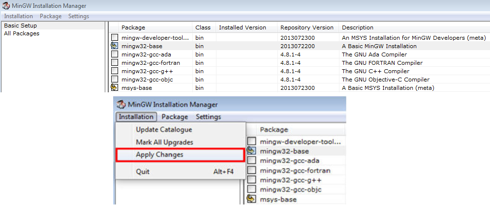

### 3.2 Build an example application
To build an example application, follow these steps.

1. Open terminal, then change the directory to the example application project
directory, which has a path similar to the following
_&lt;install\_dir&gt;/boards/&lt;board\_name&gt;/&lt;example\_type&gt;/&lt;core\_type&gt;/&lt;application\_name&gt;/riscvgcc_
For this example, the exact path is: _&lt;install\_dir&gt;/examples/rv32m1\_vega/demo\_apps/hello\_world/ri5cy/riscvgcc_
**NOTE**
To change directories, use the 'cd' command.

2. For Linux, type "build\_debug.sh" or "build\_release.sh" on the command line;
for Windows, type "build\_debug.bat" or "build\_release.bat" on the command line,
or double click on the "\*.bat" file in Windows Explorer.

### 3.3 Run an example application

This section describes steps to run a demo application using J-Link + OpenOCD. Before this, make sure:
1. The OpenOCD is set up corretly, see Appendix A for how to install.
2. The J-Link is connected to the target board J55.
3. The boot configuration is chaged accordingly, see Appendix B for how to change.

#### 3.3.1 Run using OpenOCD + telnet

The OpenOCD configure files are in the folder _&lt;install\_dir&gt;/boards/&lt;board\_name&gt;_, to reach the
configure file easily, it is recommended to define system variable `RV32M1_SDK_DIR` as the SDK install path.
Then you can use like this easily at any folder.
```bash
openocd -f $RV32M1_SDK_DIR/boards/<board_name>/rv32m1_ri5cy.cfg
```

1. Use OpenOCD to connect to the target
```bash
cd $RV32M1_SDK_DIR/boards/<board_name>/demo_apps/hello_world/ri5cy/riscvgcc/release
openocd -f $RV32M1_SDK_DIR/boards/<board_name>/rv32m1_ri5cy.cfg
```
2. Start a new terminal and connect to OpenOCD through telnet
```bash
telnet localhost 4444
```
3. In telnet window, type `program hello_world.elf` to download the image to flash.

4. After download finished, type `reset`, the MCU will reset and run.

**NOTE**
When using the command `program \*.elf`, it uses the directory view from the
terminal where openocd is run. For example, when you run openocd in
boards/rv32m1\_vega/demo_apps/hello\_world/ri5cy/riscvgcc, you should use
`program release/hello_world.elf` to download the image.

There are some other commands used for debug:
- `reset halt` Reset the MCU and halt at the first instruction
- `halt` Halt the core
- `resume` Resume to run
- `step` Step run
- `reg [reg_name]` Read register values, the valid reg\_name include: `ra`, `sp`,
    `gp`, `tp`, `t0`-`t6`, `s0`-`s11`, `a0`-`a7`, `npc`, `ppc`, `ustatus`, `utvec`,
    `uhartid`, `uepc`, `ucause`, `mstatus`, `mtvec`, `mepc`, `mcause`, `mhartid`,
    `privlv`. `npc` is the next pc value, `ppc` is the previous pc value.
    Only use this when the core is halt
- `reg reg_name value` Set register values. Only use this when the core is halt
- `mw<w|h|b> addr value` Write word|half_word|byte value to the address
- `md<w|h|b> addr [count]` Read word|half_word|byte value from the address

For more details of the OpenOCD debug, refer the OpenOCD user guide.
The steps for Zero\_riscy is similar with RI5CY, the only difference is
using different OpenOCD config file:
```bash
openocd -f $RV32M1_SDK_DIR/boards/<board_name>/rv32m1_zero_riscy.cfg
```

#### 3.3.2 Run using OpenOCD + GDB

1. Use OpenOCD to connect to the target
```bash
openocd -f $RV32M1_SDK_DIR/boards/<board_name>/rv32m1_ri5cy.cfg # Don't need cd to *.elf folder
```

2. Start a new terminal and start GDB
```bash
cd $RV32M1_SDK_DIR/boards/<board_name>/demo_apps/hello_world/ri5cy/riscvgcc/release
riscv32-unknown-elf-gdb hello_world.elf
```

3. In GDB window, using the following command to connect to OpenOCD
```
target remote localhost:3333 # Connect to OpenOCD
load # Load the binary to flash
monitor reset  # Reset and run
```

4. In GDB, you can use `monitor + openocd cmd` to debug, for example, `monitor halt` halts the core and `monitor resume` resumes the core.

### 3.4 Build a multicore example application

This section describes the particular steps needed in order to build and run a
dual-core application. The demo application build scripts are located in this folder:
_&lt;install_dir&gt;/boards/&lt;board\_name&gt;/multicore\_examples/&lt;application\_name&gt;/&lt;core\_type&gt;/riscvgcc_
Build both applications separately, following the steps for single core examples.

### 3.5 Run a multicore example application

The SDK multicore examples boot from RI5CY, then RI5CY boots Zero\_riscy. So the
boot configuration should be set to `ri5cy_boot` before image download. The
workflow is:

1. Change to the multicore example folder:
```bash
cd <install_dir>/boards/<board_name>/multicore_examples/<application_name>/
```

2. Open OpenOCD.
```bash
openocd -f $RV32M1_SDK_DIR/boards/<board_name>/rv32m1_ri5cy.cfg
```

3. Start new terminal and connect to the target:
```bash
telnet localhost 4444
```

4. In the telnet window, use the following command to download the image.
```bash
program ri5cy/riscvgcc/release/<application_name>.elf
program zero_riscy/riscvgcc/release/<application_name>.elf
```

5. Type `reset` in telnet window to reset the target and run.


## 4 Run using Eclipse

This section describes the steps required to build, run, and debug example
applications provided in the RV32M1 SDK. The hello\_world demo application
is used as an example, although these steps can be applied to any example
application in the RV32M1 SDK.

If downloading Zero\_riscy core project, let the MCU boot
from the Zero\_riscy core. For detailed steps, see the hello\_world demo readme.txt.

### 4.1 Set up Eclipse with RISCV support

1. Download the [Eclipse](http://www.eclipse.org/downloads/packages/release/Oxygen/2) and unzip the package.

2. Download [GNU MCU Eclipse plug-in](https://gnu-mcu-eclipse.github.io/developer/releases/).

3. Open the Eclipse, open "Help -> Install New Software" to install the GNU MCU Eclipse plug-in:

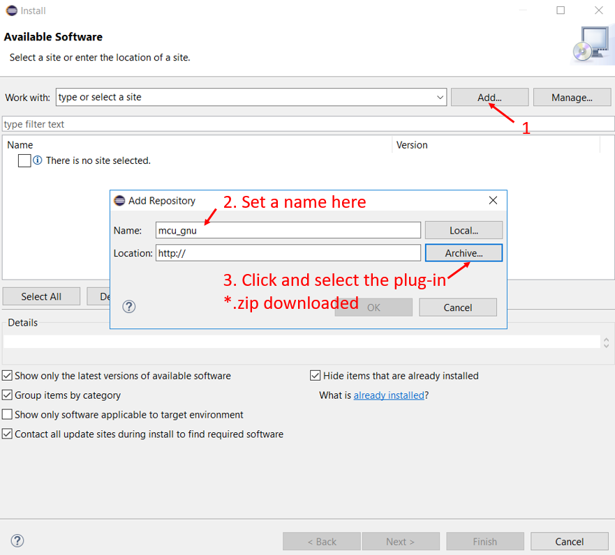

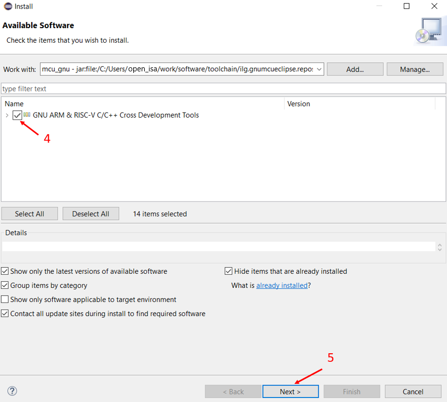

4. After installing finished, restart the Eclipse.

5. Set the RISCV GNU toolchain path to Eclipse according to your environment.

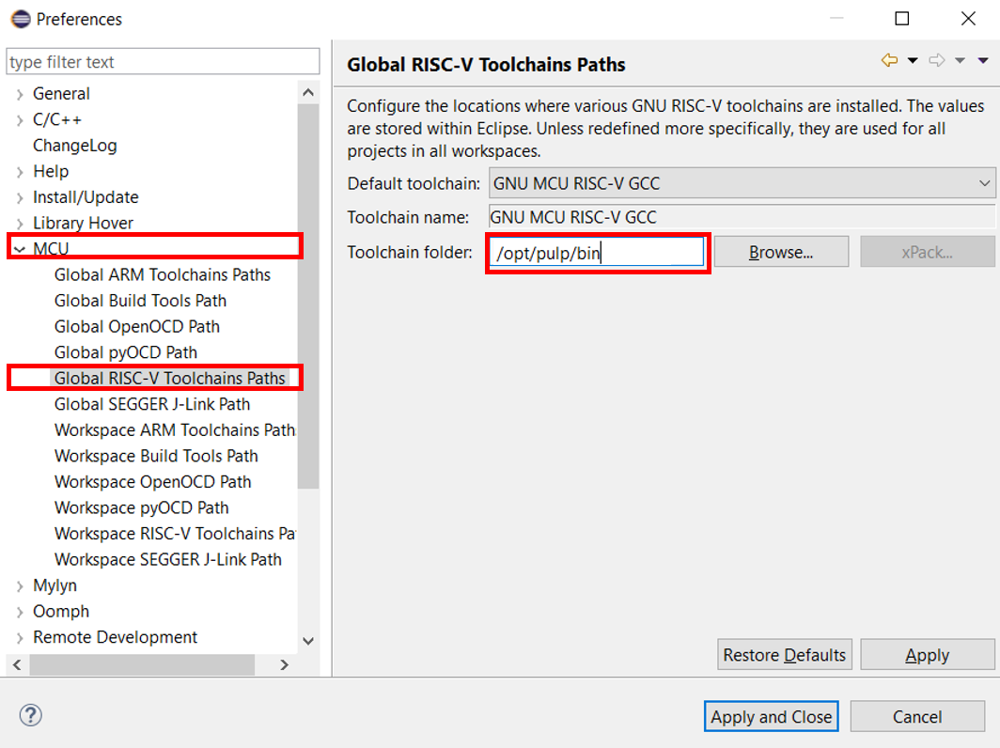

6. Follow the Appendix A to install OpenOCD, and set the OpenOCD path
to Eclipse according to your environment.

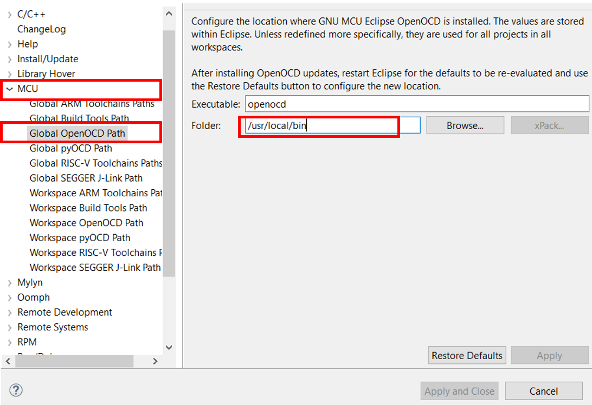

7. When using Eclipse in Windows, you need to install the Windows build tools.
Download the GNU MCU windows Build Tools
[here](https://github.com/gnu-mcu-eclipse/windows-build-tools/releases). Unzip
the package into the Eclipse folder. In Eclipse, set the _Global Build Tools Path_

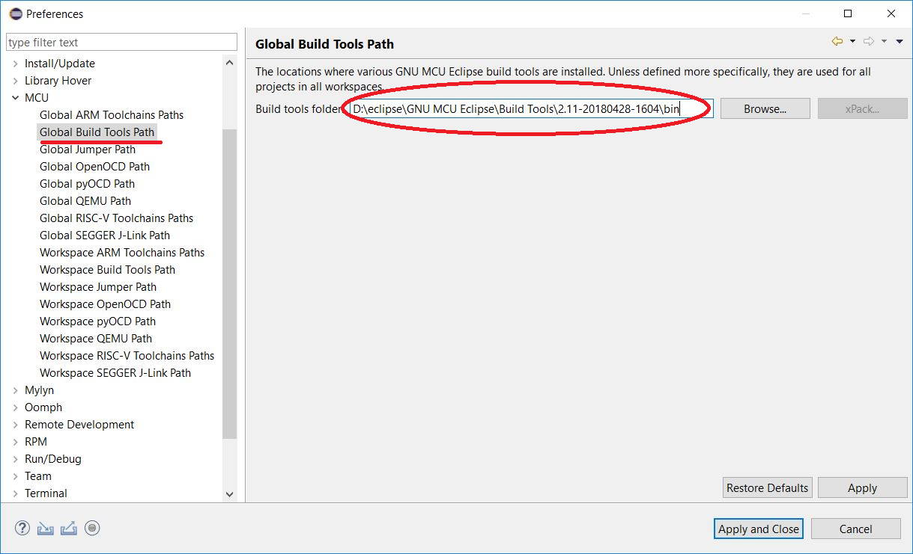

### 4.2 Build an example application

The Eclipse project is in the folder
_&lt;install_dir&gt;/boards/&lt;board\_name&gt;/&lt;example\_type&gt;/&lt;core\_type&gt;/&lt;application\_name&gt;/eclipse_
In this section, the hello_world will be used as example.

1. Import the project to Eclipse workspace. Click "File -> Import". In the import window, select "General ->
Existing Project into Workspace".

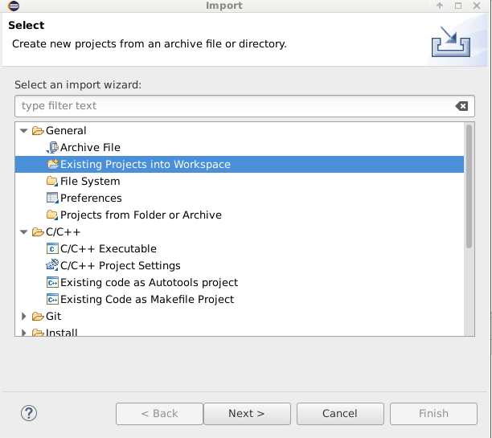

2. Browse the hello\_world folder, and select the project to import, then click "Finish".

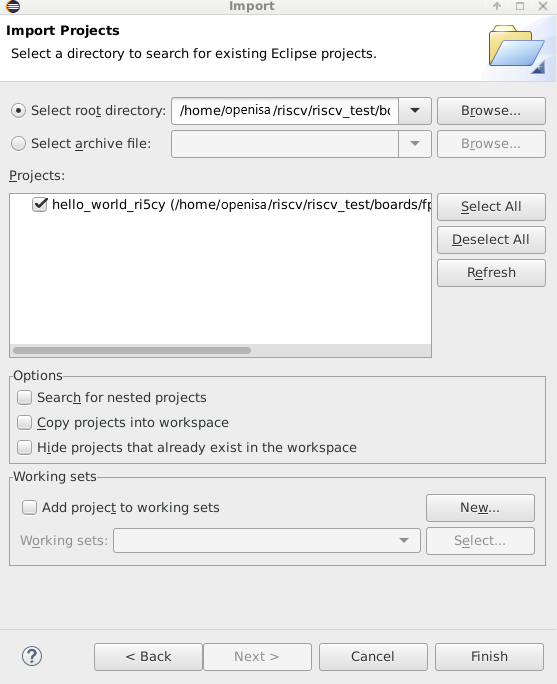

3. Click "Project -> Build project" to build the project.

### 4.3 Run an example application

Connect the Jlink to J55.

When build finished, click "Run -> Debug Configurations", select the target.

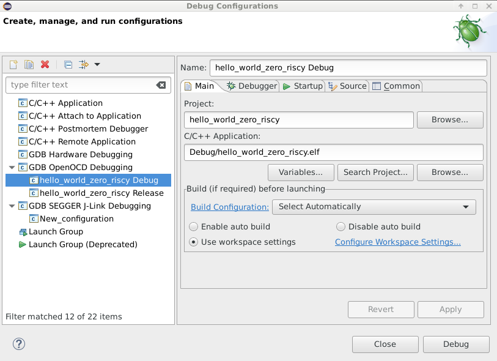

When download finished, click "resume" to run.

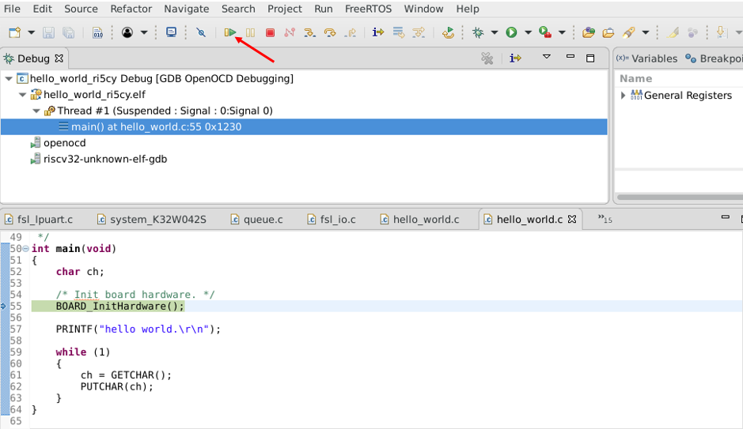

### 4.4 Build and run a multicore example application

Currently the debugging the secondary core is not supported. To run the multicore
example, set to boot from primary core, download the secondary core binary in
command line, then download and run the primary core project.

## 5 Appendix A - Install OpenOCD

This section describes the steps to install the OpenOCD with RISCV support.

### 5.1 Install on Linux
The steps here are verified on Ubuntu 18.04.

1. Dependency preparation
```bash
sudo apt-get install autoconf automake autotools-dev curl libmpc-dev libmpfr-dev libgmp-dev gawk build-essential bison flex texinfo gperf libtool patchutils bc zlib1g-dev libusb-1.0-0-dev libudev1 libudev-dev g++
```

2. Build the OpenOCD
```bash
# Download the source code
git clone --recurse https://github.com/open-isa-rv32m1/rv32m1-openocd.git
# Build and install
cd rv32m1-openocd
./bootstrap
./configure
make
sudo make install
```

### 5.2 Install on Mac OS X

1. Dependency preparation

you will need

- Xcode5
- Command Line Tools (install from Xcode5->Preferences->Downloads)
- Homebrew

then run

```bash
brew install libtool automake libusb libusb-compat
```

2. Build the OpenOCD

```bash
# Download the source code
git clone --recurse https://github.com/open-isa-rv32m1/rv32m1-openocd.git
# Build and install
cd rv32m1-openocd
./bootstrap
./configure
make
sudo make install
```

### 5.3 Install on Windows

1. Download the prebuilt OpenOCD for RV32M1. [Link](www.open-isa.org)
2. Download and extract the official prebuilt OpenOCD for Windows. [Link](http://sysprogs.com/files/gnutoolchains/arm-eabi/openocd/OpenOCD-20180728.7z)
3. Plug in the Jlink.
4. Open drivers/UsbDriverTool.exe in the official OpenOCD package.
5. Right click the "Jlink Driver", and select "Install WinUSB" to install USB driver.
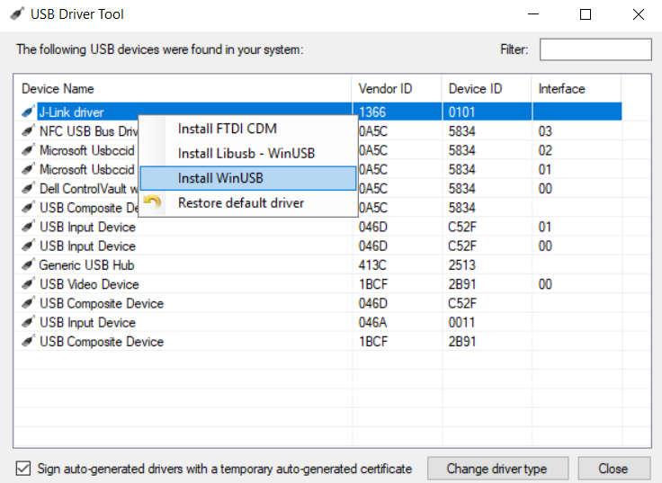

   When the USB driver installed, the Jlink could not be recognised by SEGGER software
   anymore. For recovery, run UsbDriverTool.exe and click "restore Default driver"
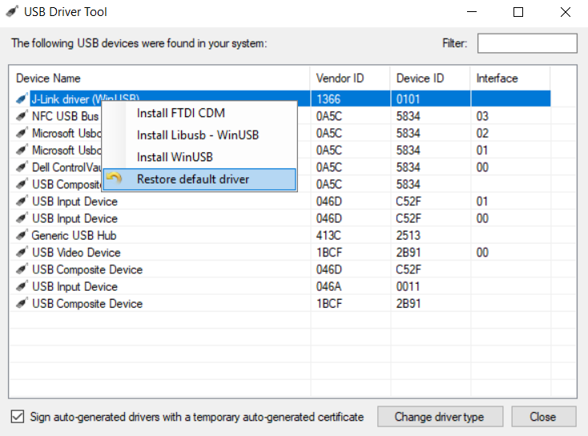
6. During RV32M1 debug, the OpenOCD from step 1 is used. So add the path of OpenOCD.exe to
   system enviroment variable PATH.

## 6 Appendix B - Change the boot configuration

In this section, the reset pin SW1 for RV32M1-VEGA board.

Follow the next steps to change the boot configuration.
**Note:** The entire flash is erased when after change the boot configuration.

1. Use OpenOCD to connect to the target
```bash
openocd -f $RV32M1_SDK_DIR/boards/<board_name>/rv32m1_ri5cy.cfg
```

2. Start a new terminal and connect to OpenOCD through telnet
```bash
telnet localhost 4444
```

3. Press and hold the reset pin, run `ri5cy_boot` in the telnet window.

4. When finished, release the reset pin. Then press and release it again to make the new configuration takes effect.

5. In the step 3, other commands such as `zero_boot`, `cm4_boot`, and `cm0_boot` could be used for different configurations.
